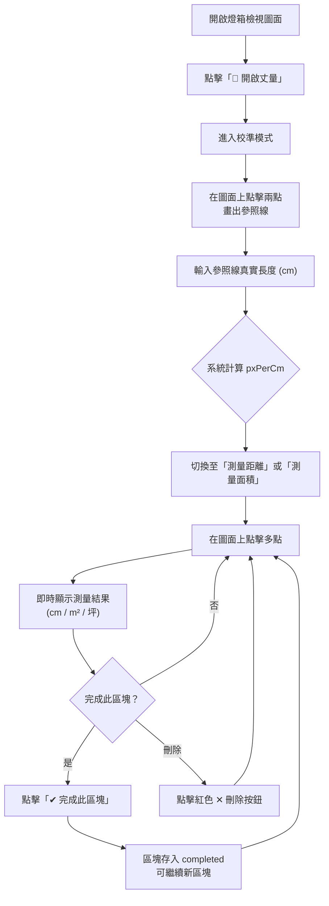

# 丈量工具功能移植規格書

> **來源檔案**: `floor-plan.html` + `css/floor-plan.css`  
> **目的**: 將丈量工具功能完整移植至其他網頁應用程式  
> **最後更新**: 2026-03-29

---

## 一、功能總覽

此丈量工具建立在一個 **圖片燈箱 (Lightbox)** 之上，透過覆蓋於圖片上方的 **Canvas** 來實現互動式丈量。使用者可以透過三種模式對圖面進行量測：

| 模式 | 說明 |
|------|------|
| **尺寸校準 (Calibrate)** | 先在圖上點兩點畫出參照直線，再輸入該直線的真實長度 (cm)，系統計算像素與公分的比例 |
| **測量距離 (Distance)** | 連續點擊多個點形成折線，即時計算各段與總長度 (cm) |
| **測量面積 (Area)** | 連續點擊多個點形成多邊形，自動計算封閉面積 (m² / 坪) |

### 核心特色
- 🔧 **多區塊疊加**: 可在同一圖面上累積多個已完成的測量區塊
- 🗑️ **個別刪除**: 每個已完成區塊附帶獨立刪除按鈕
- 🖌️ **色彩區分**: 操作中 (藍色) vs 已完成 (綠色) vs 校準線 (金色) 使用不同色系
- 📐 **即時標註**: 距離模式自動在線段中點標示長度文字；面積模式在多邊形中心標示面積
- 🔍 **縮放追蹤**: 刪除按鈕與完成按鈕隨燈箱縮放保持固定視覺大小

---

## 二、HTML 結構

### 2.1 丈量工具列 (控制面板)

```html
<!-- 丈量工具列 — 置於燈箱容器內部 -->
<div class="fp-measure-tools" id="fpMeasureTools">
    <!-- 開關按鈕 -->
    <button class="fp-measure-toggle" id="btnMeasureToggle">📏 開啟丈量</button>

    <!-- 控制面板 (預設隱藏) -->
    <div class="fp-measure-panel" id="measurePanel" style="display: none;">

        <!-- 模式切換列 -->
        <div class="fp-measure-row">
            <label>模式:</label>
            <div class="fp-measure-btn-group">
                <button id="btnMeasureModeCalibrate" class="active">尺寸校準</button>
                <button id="btnMeasureModeDistance">測量距離</button>
                <button id="btnMeasureModeArea">測量面積</button>
            </div>
        </div>

        <!-- 校準輸入 (僅校準模式時顯示) -->
        <div class="fp-measure-row" id="measureCalibrateInputRow">
            <label>設定參照直線距離 (cm):</label>
            <input type="number" id="inputMeasureCm" value="120" min="1" step="1" style="width: 70px;">
        </div>

        <!-- 清除按鈕 -->
        <div class="fp-measure-row">
            <button id="btnMeasureClear" class="fp-measure-clear-btn">重劃 / 全部清除</button>
        </div>

        <!-- 結果顯示區 -->
        <div class="fp-measure-result" id="measureResultText">請在圖上點兩點進行校準</div>
    </div>
</div>
```

### 2.2 畫布與互動容器

```html
<!-- 燈箱內容容器 — Canvas 與按鈕疊加於圖片之上 -->
<div class="fp-lightbox-content" id="fpLightboxContent">
    <!-- 底層圖片 -->
    

    <!-- 丈量畫布 (疊加於圖片正上方) -->
    <canvas id="fpMeasureCanvas"></canvas>

    <!-- 刪除按鈕容器 (動態生成的個別刪除按鈕) -->
    <div id="fpMeasureButtonsContainer"></div>

    <!-- 浮動「完成」按鈕 -->
    <button id="btnFloatingFinish" class="fp-floating-btn">✔ 完成此區塊</button>
</div>
```

### 2.3 元素 ID 對照表

| ID | 用途 | 類型 |
|----|------|------|
| `btnMeasureToggle` | 開啟/關閉丈量模式 | `<button>` |
| `measurePanel` | 工具控制面板容器 | `<div>` |
| `btnMeasureModeCalibrate` | 切換至校準模式 | `<button>` |
| `btnMeasureModeDistance` | 切換至測距模式 | `<button>` |
| `btnMeasureModeArea` | 切換至測面積模式 | `<button>` |
| `inputMeasureCm` | 校準距離輸入框 | `<input>` |
| `btnMeasureClear` | 清除所有標記 | `<button>` |
| `measureResultText` | 測量結果文字顯示 | `<div>` |
| `fpMeasureCanvas` | 繪圖畫布 | `<canvas>` |
| `fpMeasureButtonsContainer` | 動態刪除按鈕容器 | `<div>` |
| `btnFloatingFinish` | 浮動完成按鈕 | `<button>` |
| `fpLightboxImg` | 底層圖片 (用於取得自然尺寸) | `` |
| `fpLightboxContent` | 燈箱內容容器 (套用 transform) | `<div>` |

---

## 三、CSS 樣式規格

### 3.1 Canvas 定位

```css
/* Canvas 疊加於圖片上方，與圖片完全重合 */
#fpMeasureCanvas {
    position: absolute;
    top: 0;
    left: 0;
    width: 100%;
    height: 100%;
    pointer-events: none;       /* 預設不接收事件 */
    z-index: 5;
    touch-action: none;
}

/* 丈量模式啟用時，Canvas 接收滑鼠事件並顯示十字游標 */
.fp-lightbox.measuring #fpMeasureCanvas {
    pointer-events: auto;
    cursor: crosshair;
}
```

> [!IMPORTANT]
> Canvas 必須設定 `position: absolute` 並與圖片完全重合。透過 `.measuring` 類別切換 `pointer-events` 來控制是否接收滑鼠事件。

### 3.2 刪除按鈕容器

```css
#fpMeasureButtonsContainer {
    position: absolute;
    top: 0;
    left: 0;
    width: 100%;
    height: 100%;
    pointer-events: none;  /* 容器本身不阻擋，子按鈕各自啟用 */
    z-index: 6;            /* 高於 Canvas (z-index: 5) */
}
```

### 3.3 工具列佈局

```css
.fp-measure-tools {
    position: absolute;
    bottom: 30px;
    right: 30px;
    z-index: 10;
    display: flex;
    flex-direction: column-reverse;  /* 開關按鈕在下方，面板往上展開 */
    align-items: flex-end;
    gap: 12px;
}
```

### 3.4 浮動「完成」按鈕

```css
.fp-floating-btn {
    position: absolute;
    transform: translate(-50%, 15px);  /* 中心對齊最後一個點位 */
    background: #bd985c;
    color: white;
    border: none;
    padding: 6px 12px;
    border-radius: 6px;
    cursor: pointer;
    font-size: 15px;
    font-weight: bold;
    pointer-events: auto;
    box-shadow: 0 4px 12px rgba(0,0,0,0.3);
    display: none;                     /* 預設隱藏，有操作中的點才顯示 */
    white-space: nowrap;
    z-index: 10;
}
```

### 3.5 刪除按鈕

```css
.fp-delete-btn {
    position: absolute;
    transform: translate(-50%, -50%);
    background: #ef4444;
    color: white;
    border: none;
    width: 28px;
    height: 28px;
    border-radius: 50%;               /* 圓形按鈕 */
    font-size: 16px;
    font-weight: bold;
    cursor: pointer;
    pointer-events: auto;
    box-shadow: 0 2px 8px rgba(0,0,0,0.3);
    display: flex;
    align-items: center;
    justify-content: center;
}
```

### 3.6 控制面板核心樣式

```css
.fp-measure-panel {
    background: rgba(255, 255, 255, 0.95);
    backdrop-filter: blur(10px);
    border: 1px solid rgba(180, 165, 130, 0.3);
    border-radius: 12px;
    padding: 18px 20px;
    width: 320px;
    box-shadow: 0 8px 24px rgba(0,0,0,0.12);
    display: flex;
    flex-direction: column;
    gap: 14px;
}

.fp-measure-toggle {
    background: rgba(255, 255, 255, 0.85);
    backdrop-filter: blur(10px);
    border: 1px solid rgba(180, 165, 130, 0.4);
    padding: 8px 16px;
    border-radius: 20px;
    font-size: 14px;
    cursor: pointer;
}

.fp-measure-btn-group button.active {
    background: #8b6914;
    color: white;
    border-color: #8b6914;
}

.fp-measure-result {
    font-size: 15px;
    font-weight: bold;
    text-align: center;
    background: #f8f9fa;
    padding: 10px;
    border-radius: 6px;
    border: 1px dashed #ccc;
    word-break: keep-all;
    line-height: 1.5;
}
```

---

## 四、JavaScript 邏輯規格

### 4.1 狀態變數

```javascript
let measureActive = false;           // 丈量模式是否啟用
let measureMode = 'calibrate';       // 當前模式: 'calibrate' | 'distance' | 'area'
let pxPerCm = 0;                     // 像素對公分的比例 (每公分多少像素)
let measurePoints = [];              // 當前操作中的座標點陣列 [{x, y}, ...]
let completedMeasurements = [];      // 已完成的測量區塊陣列
```

#### `completedMeasurements` 資料結構

```javascript
completedMeasurements = [
    {
        mode: 'distance',              // 此區塊的測量模式
        points: [{x, y}, {x, y}, ...], // 座標點 (Canvas 內部座標)
        resultHtml: '總實測長度：150.3 cm' // 完成時的結果文字 (innerHTML)
    },
    {
        mode: 'area',
        points: [{x, y}, {x, y}, {x, y}, ...],
        resultHtml: '面積：12.5 m² <br> (3.78 坪)'
    }
];
```

### 4.2 Canvas 尺寸同步

```javascript
function resetCanvasSize() {
    if (!lightboxImg.src || !lightboxImg.naturalWidth) return;
    // Canvas 內部解析度 = 圖片原始尺寸 (非 CSS 顯示尺寸)
    measureCanvas.width = lightboxImg.naturalWidth;
    measureCanvas.height = lightboxImg.naturalHeight;
    drawMeasurement();
    updateDeleteButtons();
}

// 圖片載入完成後同步 Canvas 尺寸
lightboxImg.addEventListener('load', resetCanvasSize);
```

> [!IMPORTANT]
> Canvas 的 `width` / `height` 屬性必須設定為 **圖片的原始自然尺寸** (`naturalWidth` / `naturalHeight`)，而非 CSS 渲染尺寸。CSS 的 `width: 100%; height: 100%` 讓 Canvas 在視覺上與圖片重合，但內部座標空間保持高解析度。

### 4.3 座標轉換 (核心)

使用者在 Canvas 上點擊時，必須將瀏覽器的 viewport 座標轉換為 Canvas 內部座標：

```javascript
measureCanvas.addEventListener('mousedown', (e) => {
    if (!measureActive) return;

    const rect = measureCanvas.getBoundingClientRect();
    // 計算 CSS 顯示尺寸 → Canvas 內部座標的縮放比
    const scaleX = measureCanvas.width / rect.width;
    const scaleY = measureCanvas.height / rect.height;
    // 轉換座標
    const px = (e.clientX - rect.left) * scaleX;
    const py = (e.clientY - rect.top) * scaleY;

    // ... 依據 measureMode 處理
});
```

> [!WARNING]
> **移植關鍵**: `getBoundingClientRect()` 取得的是 CSS 渲染後的尺寸 (受 transform scale 影響)。由於燈箱本身有縮放 (`lbScale`)，`rect.width` 與 `rect.height` 會隨燈箱縮放而自動變化，因此此轉換公式自動適應縮放場景。

### 4.4 模式切換邏輯

```javascript
function setMode(mode, btn) {
    measureMode = mode;
    // 1. 切換按鈕 active 狀態
    [btnModeCalibrate, btnModeDistance, btnModeArea].forEach(b => b.classList.remove('active'));
    btn.classList.add('active');

    // 2. 清空「當前」操作中的點 (不清除已完成的區塊)
    measurePoints = [];
    btnFloatingFinish.style.display = 'none';

    // 3. 根據模式更新 UI
    if (mode === 'calibrate') {
        measureResultText.textContent = '請在圖上點出兩點進行校準';
        document.getElementById('measureCalibrateInputRow').style.display = 'flex';
    } else if (mode === 'distance') {
        if (!pxPerCm) {
            measureResultText.textContent = '請先完成「尺寸校準」!!';
            return;  // 未校準時阻擋操作
        }
        measureResultText.textContent = '點擊畫面畫出測距線';
        document.getElementById('measureCalibrateInputRow').style.display = 'none';
    } else if (mode === 'area') {
        if (!pxPerCm) {
            measureResultText.textContent = '請先完成「尺寸校準」!!';
            return;  // 未校準時阻擋操作
        }
        measureResultText.textContent = '點選畫出多邊形封閉範圍';
        document.getElementById('measureCalibrateInputRow').style.display = 'none';
    }
    drawMeasurement();
}
```

> [!NOTE]
> - 校準輸入欄 (`measureCalibrateInputRow`) 僅在校準模式時顯示
> - 切換模式時只清除當前操作中的點 (`measurePoints`)，不影響已完成區塊 (`completedMeasurements`)
> - 距離 / 面積模式要求 `pxPerCm > 0` (已完成校準)

### 4.5 點擊處理邏輯 (依模式分流)

```javascript
measureCanvas.addEventListener('mousedown', (e) => {
    if (!measureActive) return;

    // 座標轉換 (見 4.3 節)
    const rect = measureCanvas.getBoundingClientRect();
    const scaleX = measureCanvas.width / rect.width;
    const scaleY = measureCanvas.height / rect.height;
    const px = (e.clientX - rect.left) * scaleX;
    const py = (e.clientY - rect.top) * scaleY;

    if (measureMode === 'calibrate') {
        // 校準模式: 每次最多兩點，第三點自動重設
        if (measurePoints.length >= 2) measurePoints = [];
        measurePoints.push({ x: px, y: py });
        if (measurePoints.length === 2) {
            calculateCalibration();
        } else {
            measureResultText.textContent = '請點擊第二點完成校準線';
        }
        btnFloatingFinish.style.display = 'none';  // 校準不需完成按鈕
    } else {
        if (!pxPerCm) return;  // 安全檢查
        measurePoints.push({ x: px, y: py });
        calculateMeasurement();

        // 將「完成」按鈕定位到最後一個打點位置
        const pctX = (px / measureCanvas.width) * 100;
        const pctY = (py / measureCanvas.height) * 100;
        btnFloatingFinish.style.left = `${pctX}%`;
        btnFloatingFinish.style.top = `${pctY}%`;
        btnFloatingFinish.style.display = 'block';
    }
    drawMeasurement();
});
```

### 4.6 校準計算

```javascript
function calculateCalibration() {
    const p1 = measurePoints[0];
    const p2 = measurePoints[1];
    // 兩點之間的像素距離
    const distPx = Math.sqrt(Math.pow(p2.x - p1.x, 2) + Math.pow(p2.y - p1.y, 2));
    // 使用者輸入的真實距離 (cm)
    const targetCm = parseFloat(inputMeasureCm.value) || 120;
    // 計算比例: 1 cm = ? px
    pxPerCm = distPx / targetCm;
    measureResultText.textContent = `校準完成！(比例: 1cm = ${pxPerCm.toFixed(2)}px)`;
}
```

> [!TIP]
> 校準值 `inputMeasureCm` 變更時，若已有兩個校準點，會自動重新計算：
> ```javascript
> inputMeasureCm.addEventListener('change', () => {
>     if (measurePoints.length === 2 && measureMode === 'calibrate') {
>         calculateCalibration();
>     }
> });
> ```

### 4.7 測量計算

```javascript
function calculateMeasurement() {
    if (measurePoints.length < 2) return;

    if (measureMode === 'distance') {
        // 累加所有線段的像素距離
        let totalDistPx = 0;
        for (let i = 1; i < measurePoints.length; i++) {
            const p1 = measurePoints[i - 1];
            const p2 = measurePoints[i];
            totalDistPx += Math.sqrt(Math.pow(p2.x - p1.x, 2) + Math.pow(p2.y - p1.y, 2));
        }
        const cm = totalDistPx / pxPerCm;
        measureResultText.textContent = `總實測長度：${cm.toFixed(1)} cm`;

    } else if (measureMode === 'area') {
        if (measurePoints.length < 3) {
            measureResultText.textContent = '請標記至少三點以形成面積';
            return;
        }
        // Shoelace formula 計算多邊形面積 (px²)
        let areaPx = 0;
        let j = measurePoints.length - 1;
        for (let i = 0; i < measurePoints.length; i++) {
            areaPx += (measurePoints[j].x + measurePoints[i].x) *
                       (measurePoints[j].y - measurePoints[i].y);
            j = i;
        }
        areaPx = Math.abs(areaPx / 2);

        // 轉換單位
        const cm2 = areaPx / (pxPerCm * pxPerCm);  // cm²
        const m2 = cm2 / 10000;                      // m²
        const ping = m2 * 0.3025;                     // 坪 (台灣)

        measureResultText.innerHTML = `面積：${m2.toFixed(2)} m² <br> (${ping.toFixed(2)} 坪)`;
    }
}
```

> [!NOTE]
> **單位轉換公式**:
> - `1 m² = 10,000 cm²`
> - `1 m² = 0.3025 坪` (台灣坪數)

### 4.8 Canvas 繪圖引擎 (`drawMeasurement` + `renderShape`)

#### 主繪圖函式

```javascript
function drawMeasurement() {
    ctx.clearRect(0, 0, measureCanvas.width, measureCanvas.height);

    // 1. 先繪製所有「已完成」的區塊
    completedMeasurements.forEach((shape) => {
        renderShape(shape.mode, shape.points, true);
    });

    // 2. 再繪製「操作中」的點位
    if (measurePoints.length > 0) {
        renderShape(measureMode, measurePoints, false);
    }
}
```

#### 形狀繪製函式

```javascript
function renderShape(mode, points, isCompleted) {
    // ---- 自適應線寬與點半徑 ----
    ctx.lineWidth = Math.max(2, measureCanvas.width / 800);
    const radius = Math.max(4, measureCanvas.width / 400);

    // ---- 色彩方案 ----
    //   校準線: 金色 #bd985c
    //   操作中: 藍色 #2563eb
    //   已完成: 綠色 #10b981
    let strokeColor = mode === 'calibrate' ? '#bd985c' : '#2563eb';
    let fillColor = strokeColor;
    if (mode === 'area') {
        fillColor = isCompleted ? 'rgba(16,185,129,0.25)' : 'rgba(37,99,235,0.2)';
        strokeColor = isCompleted ? '#10b981' : '#2563eb';
    } else if (isCompleted) {
        strokeColor = '#10b981';
        fillColor = '#10b981';
    }

    // ---- 繪製線段/多邊形 ----
    ctx.strokeStyle = strokeColor;
    ctx.fillStyle = fillColor;
    ctx.beginPath();
    ctx.moveTo(points[0].x, points[0].y);
    for (let i = 1; i < points.length; i++) {
        ctx.lineTo(points[i].x, points[i].y);
    }
    if (mode === 'area' && points.length >= 3) {
        ctx.closePath();      // 封閉多邊形
        ctx.fill();           // 填充半透明色
    }
    ctx.stroke();

    // ---- 繪製頂點圓點 ----
    ctx.fillStyle = isCompleted ? '#059669' : '#ef4444';
    points.forEach((p, index) => {
        ctx.beginPath();
        ctx.arc(p.x, p.y, radius, 0, Math.PI * 2);
        ctx.fill();

        // ---- 距離模式: 在每段線段中點標註長度 ----
        if (mode === 'distance' && index > 0 && pxPerCm > 0) {
            const prev = points[index - 1];
            const distPx = Math.sqrt(Math.pow(p.x - prev.x, 2) + Math.pow(p.y - prev.y, 2));
            const cm = distPx / pxPerCm;
            const midX = (prev.x + p.x) / 2;
            const midY = (prev.y + p.y) / 2;
            const text = `${cm.toFixed(1)}cm`;

            ctx.save();
            ctx.font = `bold ${Math.max(16, measureCanvas.width / 60)}px sans-serif`;
            ctx.fillStyle = 'black';
            ctx.strokeStyle = '#fff';
            ctx.lineWidth = Math.max(3, measureCanvas.width / 150);
            ctx.lineJoin = 'round';
            ctx.lineCap = 'round';
            ctx.textAlign = 'center';
            ctx.textBaseline = 'bottom';
            ctx.strokeText(text, midX, midY - 5);  // 白色邊框 (可讀性)
            ctx.fillText(text, midX, midY - 5);     // 黑色文字
            ctx.restore();
        }
    });

    // ---- 面積模式: 在多邊形中心標註面積 ----
    if (mode === 'area' && points.length >= 3 && pxPerCm > 0) {
        // 計算重心
        let cx = 0, cy = 0;
        points.forEach(p => { cx += p.x; cy += p.y; });
        cx /= points.length;
        cy /= points.length;

        // 重新計算面積 (用於繪圖標註)
        let areaPx = 0;
        let j = points.length - 1;
        for (let i = 0; i < points.length; i++) {
            areaPx += (points[j].x + points[i].x) * (points[j].y - points[i].y);
            j = i;
        }
        areaPx = Math.abs(areaPx / 2);
        const cm2 = areaPx / (pxPerCm * pxPerCm);
        const m2 = cm2 / 10000;
        const ping = m2 * 0.3025;

        ctx.save();
        ctx.textAlign = 'center';
        ctx.textBaseline = 'middle';
        ctx.font = `bold ${Math.max(22, measureCanvas.width / 40)}px sans-serif`;
        ctx.fillStyle = isCompleted ? '#059669' : '#ef4444';
        ctx.strokeStyle = '#fff';
        ctx.lineWidth = Math.max(3, measureCanvas.width / 120);
        ctx.lineJoin = 'round';
        ctx.lineCap = 'round';
        const gap = Math.max(22, measureCanvas.width / 40) + 5;

        ctx.strokeText(`${ping.toFixed(2)} 坪`, cx, cy - gap / 2);
        ctx.fillText(`${ping.toFixed(2)} 坪`, cx, cy - gap / 2);
        ctx.strokeText(`${m2.toFixed(2)} m²`, cx, cy + gap / 2);
        ctx.fillText(`${m2.toFixed(2)} m²`, cx, cy + gap / 2);
        ctx.restore();
    }
}
```

### 4.9 完成按鈕邏輯 (保存當前區塊)

```javascript
btnFloatingFinish.addEventListener('click', (e) => {
    e.stopPropagation(); // 避免觸發 Canvas 打點

    if (measurePoints.length > 0) {
        // 將當前操作中的點存入 completedMeasurements
        completedMeasurements.push({
            mode: measureMode,
            points: [...measurePoints],
            resultHtml: measureResultText.innerHTML
        });
        measurePoints = [];                         // 清空操作中的點
        btnFloatingFinish.style.display = 'none';  // 隱藏完成按鈕
        drawMeasurement();                          // 重繪 Canvas
        updateDeleteButtons();                      // 更新刪除按鈕
        measureResultText.textContent = '已保存當前圖形，可繼續點選圖面測量新區塊';
    }
});
```

### 4.10 刪除按鈕管理

```javascript
function updateDeleteButtons() {
    btnMeasureButtonsContainer.innerHTML = ''; // 清除所有舊按鈕

    completedMeasurements.forEach((shape, index) => {
        const delBtn = document.createElement('button');
        delBtn.className = 'fp-delete-btn';
        delBtn.innerHTML = '✕';
        delBtn.title = '刪除此區塊';

        const invScale = 1 / lbScale;  // 反向縮放，保持按鈕視覺大小不變
        let px, py;

        if (shape.mode === 'area') {
            // 面積: 放在 Bounding Box 右上角
            px = Math.max(...shape.points.map(p => p.x));
            py = Math.min(...shape.points.map(p => p.y));
            delBtn.dataset.position = 'top-right';
            delBtn.style.transform = `translate(-120%, 20%) scale(${invScale})`;
        } else {
            // 線段: 放在第一點
            px = shape.points[0].x;
            py = shape.points[0].y;
            delBtn.dataset.position = 'center';
            delBtn.style.transform = `translate(-50%, -50%) scale(${invScale})`;
        }

        // 使用百分比定位 (相對於圖片尺寸)
        const pctX = (px / measureCanvas.width) * 100;
        const pctY = (py / measureCanvas.height) * 100;
        delBtn.style.left = `${pctX}%`;
        delBtn.style.top = `${pctY}%`;

        delBtn.onclick = (e) => {
            e.stopPropagation();
            completedMeasurements.splice(index, 1);  // 從陣列中移除
            drawMeasurement();
            updateDeleteButtons();                    // 遞迴更新 (因為 index 改變)
            measureResultText.textContent = '已刪除區塊';
        };

        btnMeasureButtonsContainer.appendChild(delBtn);
    });
}
```

> [!TIP]
> 刪除按鈕的定位使用 **百分比** (`pctX%`, `pctY%`)，這樣無論圖片在 CSS 中被縮放到什麼大小，按鈕都能正確對應到圖面上的位置。

### 4.11 清除所有標記

```javascript
btnMeasureClear.addEventListener('click', () => {
    measurePoints = [];
    completedMeasurements = [];
    btnFloatingFinish.style.display = 'none';
    drawMeasurement();
    updateDeleteButtons();
    if (measureMode !== 'calibrate' && !pxPerCm) {
        measureResultText.textContent = '請先完成「尺寸校準」!!';
    } else {
        measureResultText.textContent = '已清除標記';
    }
});
```

### 4.12 丈量模式開關

```javascript
btnMeasureToggle.addEventListener('click', () => {
    measureActive = !measureActive;
    if (measureActive) {
        lightbox.classList.add('measuring');          // 啟用 Canvas pointer-events
        measurePanel.style.display = 'flex';         // 顯示控制面板
        btnMeasureToggle.textContent = '❌ 關閉丈量';
    } else {
        lightbox.classList.remove('measuring');       // 停用 Canvas pointer-events
        measurePanel.style.display = 'none';        // 隱藏控制面板
        btnMeasureToggle.textContent = '📏 開啟丈量';
    }
});
```

> [!IMPORTANT]
> 當 `measureActive = true` 時，燈箱的**拖曳**與**雙擊還原**功能必須被禁用：
> ```javascript
> // 拖曳事件中
> if (measureActive) return;
> // 雙擊事件中
> if (measureActive) return;
> ```

### 4.13 燈箱縮放時的按鈕補償

每次燈箱 transform 更新時，需要反向補償按鈕的尺寸：

```javascript
function updateLightboxTransform() {
    // 套用縮放平移到內容容器
    lightboxContent.style.transform = `translate(${lbTx}px, ${lbTy}px) scale(${lbScale})`;

    // 反向縮放: 讓按鈕保持固定視覺大小
    const invScale = 1 / lbScale;
    const floatingBtn = document.getElementById('btnFloatingFinish');
    if (floatingBtn) floatingBtn.style.transform = `translate(-50%, 15px) scale(${invScale})`;

    document.querySelectorAll('.fp-delete-btn').forEach(btn => {
        if (btn.dataset.position === 'top-right') {
            btn.style.transform = `translate(-120%, 20%) scale(${invScale})`;
        } else {
            btn.style.transform = `translate(-50%, -50%) scale(${invScale})`;
        }
    });
}
```

### 4.14 圖面切換時的重置行為

每當使用者切換不同圖面（載入新圖片）時，必須：

```javascript
// 關閉丈量模式
if (measureActive) btnMeasureToggle.click();
// 清除所有標記
btnMeasureClear.click();
// 重置比例尺 (每張圖的比例不同)
pxPerCm = 0;
// 強制返回校準模式
btnMeasureModeCalibrate.click();
// 延遲重設 Canvas 尺寸 (等待新圖片載入)
setTimeout(() => resetCanvasSize(), 100);
```

---

## 五、操作流程 (使用者旅程)



---

## 六、移植注意事項

### 6.1 最少必要依賴

| 項目 | 說明 |
|------|------|
| **HTML 結構** | 需要一個包含 `` + `<canvas>` + 按鈕容器的父容器 |
| **CSS** | 需要 Canvas 的 `position: absolute` 定位、`.measuring` 類別、按鈕樣式 |
| **JavaScript** | 純 Vanilla JS，無需任何第三方程式庫 |

### 6.2 可抽離的獨立模組

丈量工具可以封裝為一個獨立類別或模組：

```javascript
// 建議模組介面
class MeasureTool {
    constructor({ imageElement, canvasElement, panelElement, ... }) { ... }
    enable() { ... }       // 啟用丈量模式
    disable() { ... }      // 停用丈量模式
    setMode(mode) { ... }  // 'calibrate' | 'distance' | 'area'
    clear() { ... }        // 清除所有標記
    reset() { ... }        // 重置校準與標記
    destroy() { ... }      // 銷毀事件監聽
}
```

### 6.3 必須適配的外部狀態

| 外部狀態 | 用途 | 移植時需提供 |
|----------|------|------------|
| `lbScale` | 燈箱的當前縮放比例 | 用於計算刪除/完成按鈕的反向縮放 |
| `measureActive` | 控制拖曳/雙擊事件是否禁止 | 在父容器的滑鼠事件中檢查 |
| 圖片載入事件 | 切換圖片時重置 Canvas | 監聽 `` 的 `load` 事件 |
| 圖片容器的 `transform` | Canvas 隨圖片一起縮放平移 | Canvas 和圖片必須在同一個 transform 容器內 |

### 6.4 不需移植的部分

以下是原始檔案中屬於**燈箱母體**的功能，丈量工具不直接依賴：

- 360° 全景檢視器 (Pannellum)
- 坪數資訊面板
- 導覽列高亮邏輯
- 背景光球動畫
- 螢火蟲動畫

### 6.5 事件衝突處理

> [!CAUTION]
> 丈量工具啟用時，必須阻止以下行為：
> 1. **拖曳平移**: `mousedown` 事件中若 `measureActive === true` 則 `return`
> 2. **雙擊還原**: `dblclick` 事件中若 `measureActive === true` 則 `return`
> 3. **點擊工具列時不觸發背景拖曳**: 利用 `e.target.closest('.fp-measure-tools')` 判斷

---

## 七、色彩方案速查表

| 狀態 | 線條/邊框 | 填充 | 頂點圓點 | 文字 |
|------|-----------|------|----------|------|
| 校準線 | `#bd985c` (金色) | — | `#ef4444` (紅) | — |
| 操作中 (距離) | `#2563eb` (藍) | — | `#ef4444` (紅) | 黑字白框 |
| 操作中 (面積) | `#2563eb` (藍) | `rgba(37,99,235,0.2)` | `#ef4444` (紅) | `#ef4444` |
| 已完成 (距離) | `#10b981` (綠) | — | `#059669` (深綠) | 黑字白框 |
| 已完成 (面積) | `#10b981` (綠) | `rgba(16,185,129,0.25)` | `#059669` (深綠) | `#059669` |

---

## 八、自適應尺寸公式

所有繪圖參數皆依據 Canvas 寬度自動調整：

| 參數 | 計算公式 | 最小值 |
|------|----------|--------|
| 線寬 | `measureCanvas.width / 800` | 2px |
| 頂點半徑 | `measureCanvas.width / 400` | 4px |
| 距離文字大小 | `measureCanvas.width / 60` | 16px |
| 距離文字邊框 | `measureCanvas.width / 150` | 3px |
| 面積文字大小 | `measureCanvas.width / 40` | 22px |
| 面積文字邊框 | `measureCanvas.width / 120` | 3px |

---

## 九、完整可複製的最小實作範例

以下為一個獨立的最小範例，可直接在新網頁中運行：

```html
<!-- 最小結構: 圖片容器 + Canvas + 控制面板 -->
<div id="measureContainer" style="position: relative; display: inline-block;">
    
    <canvas id="measureCanvas" style="position: absolute; top:0; left:0; width:100%; height:100%;
         pointer-events: none; z-index: 5;"></canvas>
    <div id="measureBtns" style="position: absolute; top:0; left:0; width:100%; height:100%;
         pointer-events: none; z-index: 6;"></div>
    <button id="btnFinish" style="position: absolute; display: none; z-index: 10;
         pointer-events: auto;">✔ 完成</button>
</div>

<!-- 控制面板 (可自行調整位置) -->
<div id="controlPanel">
    <button id="btnToggle">📏 開啟丈量</button>
    <select id="modeSelect">
        <option value="calibrate">尺寸校準</option>
        <option value="distance">測量距離</option>
        <option value="area">測量面積</option>
    </select>
    <label>校準長度 (cm): <input type="number" id="inputCm" value="120" min="1"></label>
    <button id="btnClear">清除</button>
    <div id="resultText">請先校準</div>
</div>
```

> [!TIP]
> 完整的 JavaScript 邏輯請直接從本文第四章節複製並組合即可使用。核心函式依賴關係為：
> `resetCanvasSize()` → `drawMeasurement()` → `renderShape()` → `updateDeleteButtons()` → `calculateCalibration()` / `calculateMeasurement()`
